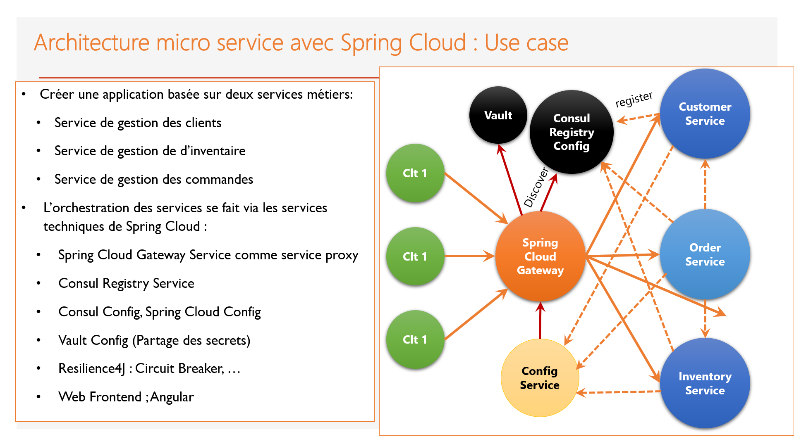

# micro-services-spring-boot-gestion-des-commandes

Créer une application de e-commerce basée sur les micro services :

- Consul Discovery
- Spring Cloud Config
- Spring Cloud Gateway
- Customer-service
- Inventory Service
- Order Service
- Consul Config (Billing Service)
- Vault (Billing Service)
- Frontend Web avec Angular

---

### Consul :

   - Install Consul
   - lancer Consul par la commande : il faut remplacer @IP par votre ip

      >   consul agent -server -bootstrap-expect=1 -data-dir=consul-data -ui -bind=@IP

   - consul ui url : http://localhost:8500/

### Vault :

   - Install Vault
   - lancer Vault par la commande suivant en mode dev

      >   vault server -dev

   - Vault ui url : http://127.0.0.1:8200
   - après utiliser token existe dans le terminal (aprés l'execution de la commande)

### billing-service : [:point_right:](./billing-service)

 - pour tester Consul Config et Vault 

### ecom-services :

 - contient la configuration (config-repo)
 - vous pouvez ouvrir ecom-services pour ouvrir tous les services au même temp

### config-service : [:point_right:](./config-service)

### gateway-service : [:point_right:](./gateway-service)

### customer-service : [:point_right:](./customer-service)

### inventory-service : [:point_right:](./inventory-service)

### order-service : [:point_right:](./order-service)

