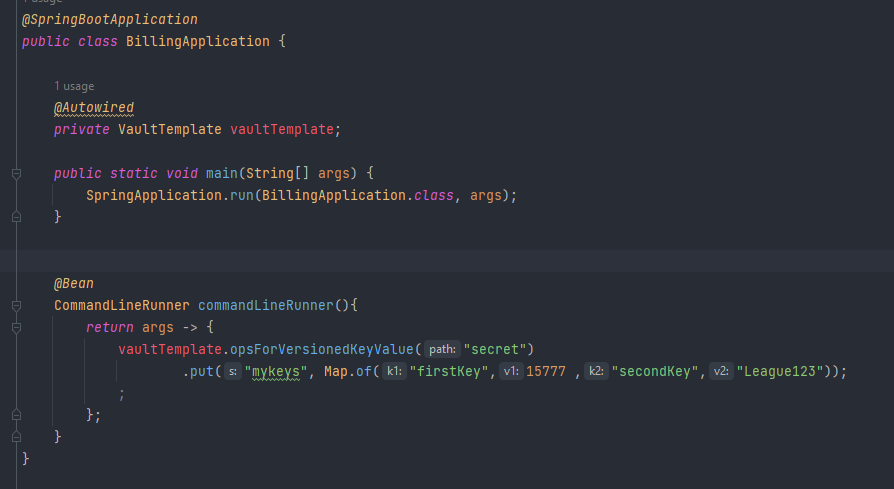
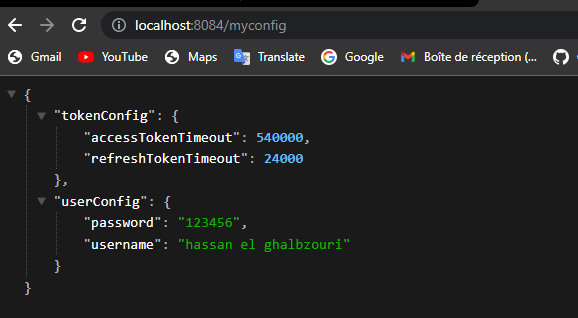

# Billing service :
  
  Pour tester Vault et Consul config 

- configs :

    Pour recuperer la configuration 

    - TokenConfigConsul

      
  
    - UserConfigVault

      

- web :

  

- BillingApplication :
  
  Pour envoyer des secrets au Vault à partir de ce service
  
  

- application.properties :

  

- info : 

    - Lorsque on fait un changement dans config de consul automatiquement il change dans le service 
    - mais pour Vault il faut en voyer un request post pour refresh (et puisque on a utiliser @ConfigurationProperties on a pas besoin d'ajouter @RefreshScope ): 

      
    
    
- initialiser la configuration :

    * Consul 

      
      
      
      
      
    
    * Vault 

      
    
- resulta :

    

