# Customer Service :

- entites :
 
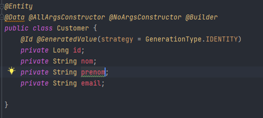

- Repositories :

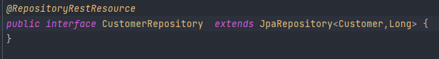

- Projections :

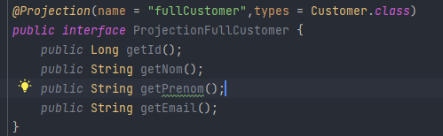

- CustomerServiceApplication :

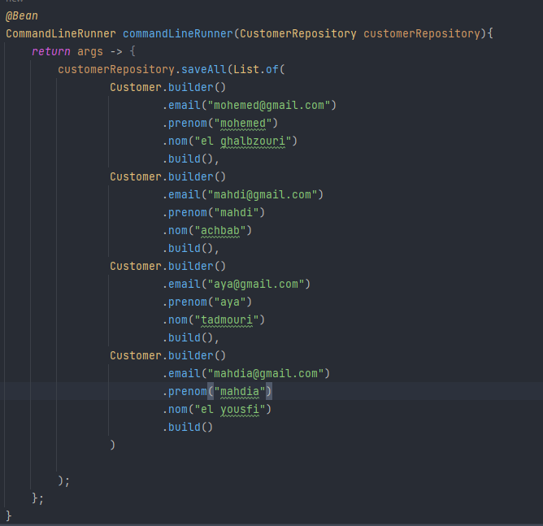

- application.properties :

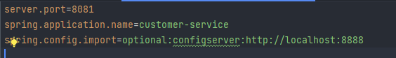

- configs :
    
    ajouter configuration dans Consul :

     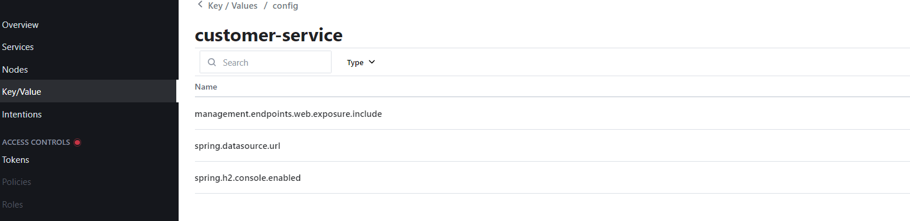

    et enregistrer sous forme key value

     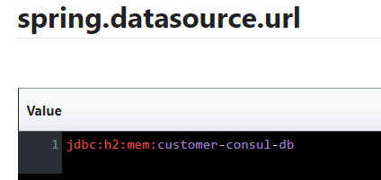
  
     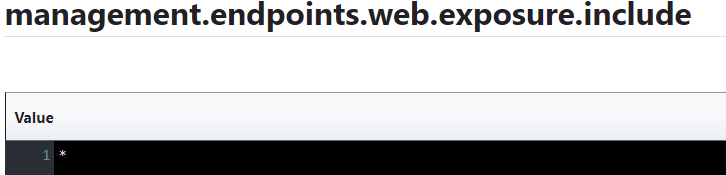
  
     
  
    pour configurations à partir de consul config on ajoute des classes  :

    - ConsulConfigConsoleEnabled
        
        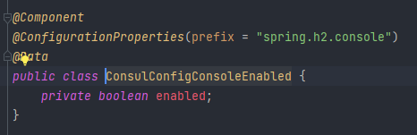
      
    - ConsulConfigManagementEndpoints

        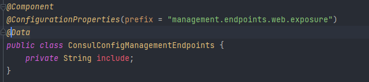
      
    - ConsulConfigUrlDatasource

        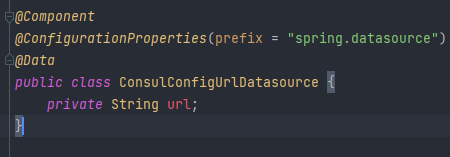
      
    
    
### Resulla :

- h2 database :

    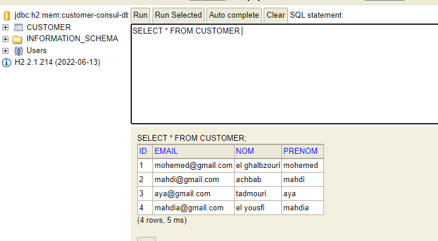
  
- RestResource avec projection:

    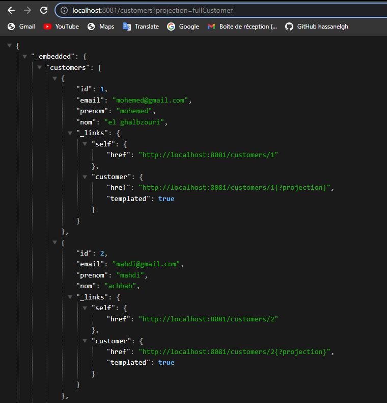

