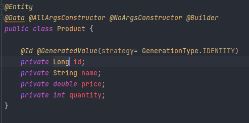
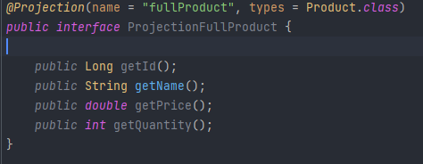
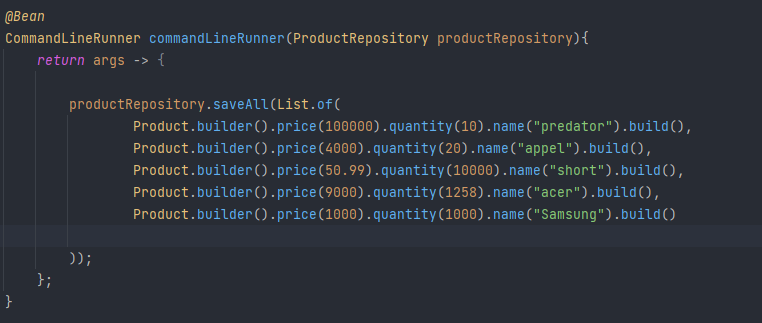
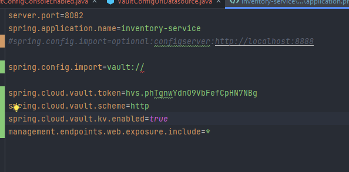
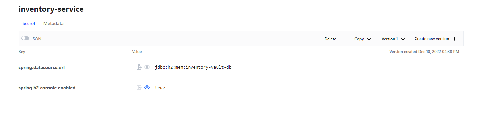
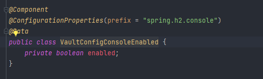
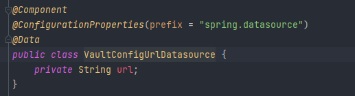
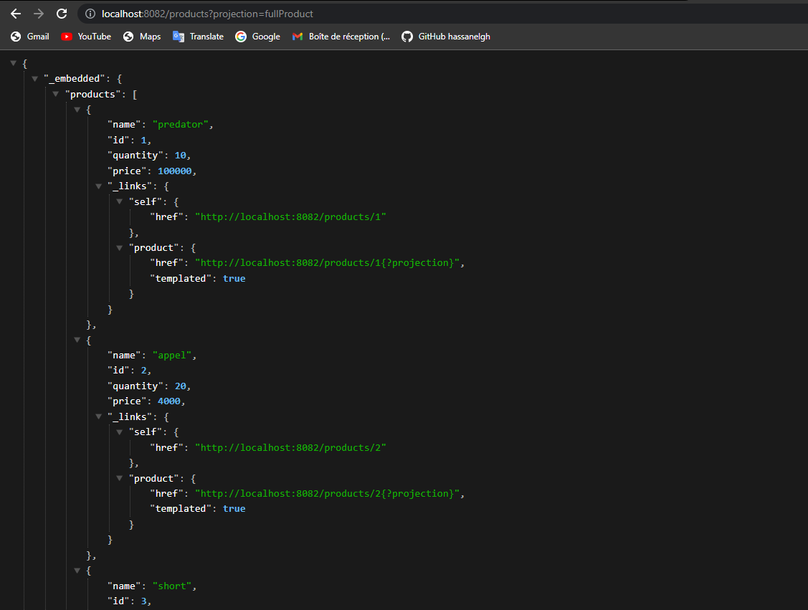

# Inventory Service :

- entites :
 

- Repositories :

- Projections :

- InventoryServiceApplication :

- application.properties :

- configs :

    ajouter configuration dans Vault :

     

    et enregistrer sous forme key value

     
 
    pour configurations à partir de Vault on ajoute des classes  :

    - VaultConfigConsoleEnabled

        
    
    - VaultConfigUrlDatasource

        

### Resulla :

- h2 database :

    

- RestResource avec projection:

    

