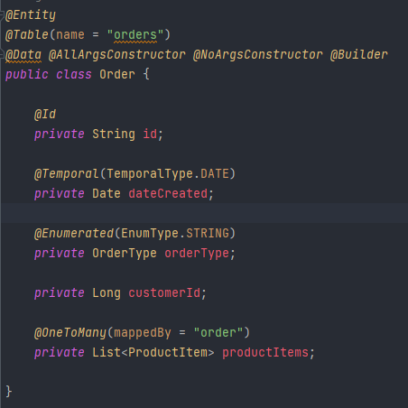
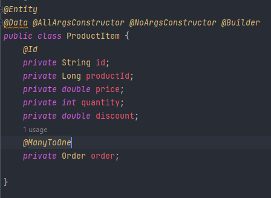
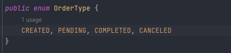
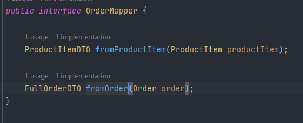
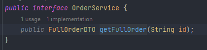
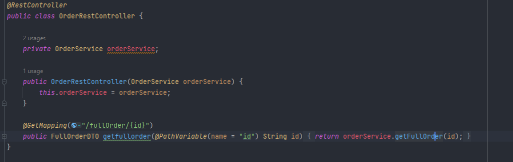
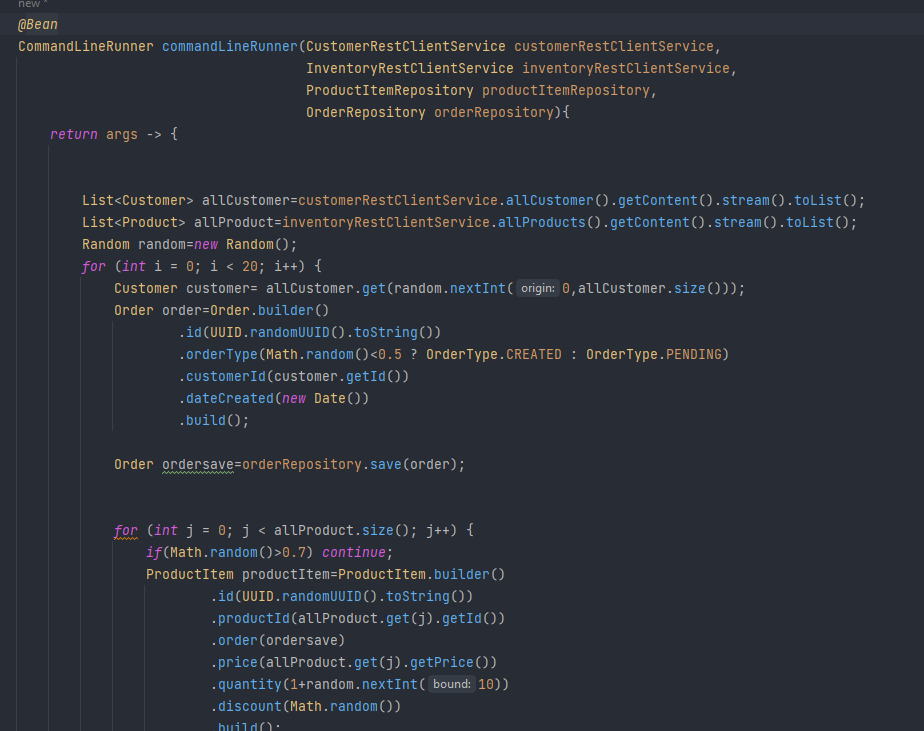
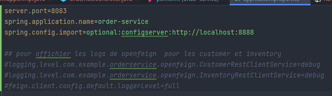

# Order Service 

- entities :

   - Order : [:point_right:](./src/main/java/com/example/orderservice/entities/Order.java)

   

   - ProductItem : [:point_right:](./src/main/java/com/example/orderservice/entities/ProductItem.java)

   

- enums :

   - OrderType : [:point_right:](./src/main/java/com/example/orderservice/enums/OrderType.java)

    

- dto :

  - FullOrderDTO : [:point_right:](./src/main/java/com/example/orderservice/dto/FullOrderDTO.java)
  - ProductItemDTO : [:point_right:](./src/main/java/com/example/orderservice/dto/ProductItemDTO.java)

- exceptions :

  - CustomerNotFoundException : [:point_right:](./src/main/java/com/example/orderservice/exceptions/CustomerNotFoundException.java)
  - OrderNotFoundException : [:point_right:](./src/main/java/com/example/orderservice/exceptions/OrderNotFoundException.java)
  - ProductNotFoundException : [:point_right:](./src/main/java/com/example/orderservice/exceptions/ProductNotFoundException.java)

- mappers :

  - OrderMapper : [:point_right:](./src/main/java/com/example/orderservice/mappers/OrderMapper.java)

   

  - OrderMapperImpl : [:point_right:](./src/main/java/com/example/orderservice/mappers/OrderMapperImpl.java)

- models :

  - Customer : [:point_right:](./src/main/java/com/example/orderservice/models/Customer.java)
  - Product : [:point_right:](./src/main/java/com/example/orderservice/models/Product.java)

- openfeign :

  - CustomerRestClientService : [:point_right:](./src/main/java/com/example/orderservice/openfeign/CustomerRestClientService.java)
  - InventoryRestClientService : [:point_right:](./src/main/java/com/example/orderservice/openfeign/InventoryRestClientService.java)

- repositories :

  - OrderRepository : [:point_right:](./src/main/java/com/example/orderservice/repositories/OrderRepository.java)
  - ProductItemRepository : [:point_right:](./src/main/java/com/example/orderservice/repositories/ProductItemRepository.java)

- services :

  - OrderService : [:point_right:](./src/main/java/com/example/orderservice/services/OrderService.java)

   

  - OrderServiceImpl : [:point_right:](./src/main/java/com/example/orderservice/services/OrderServiceImpl.java)

- web :

  -OrderRestController : [:point_right:](./src/main/java/com/example/orderservice/web/OrderRestController.java)

  

- OrderServiceApplication : [:point_right:](./src/main/java/com/example/orderservice/OrderServiceApplication.java)

- application.properties : [:point_right:](./src/main/resources/application.properties)

    - ajouter config import pour specifier url de config server 

